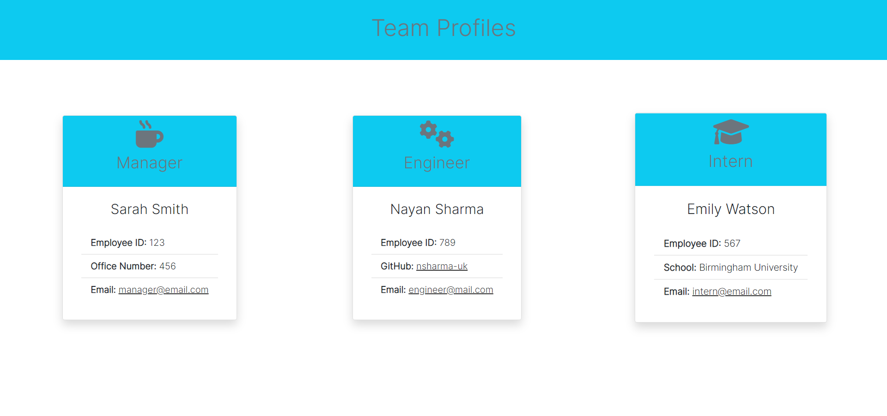
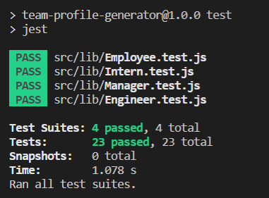

# team-profile-generator

## Project Description

This Node.js command-line application build takes in information about employees on a software engineering team, then generates an HTML webpage that displays summaries for each person.

## Demo

## Table of Contents

- [Project Description](#description)
- [Technologies](#technologies)
- [Installation](#installation)
- [Screenshots](#screenshots)
- [License](#license)
- [Tests](#tests)
- [Author](#author)
- [Contact](#contact)


## Technologies

The following technologies and packages were used in this project:

Node.js v18.2.0 and NPM v8.9.0
Node core packages: fs (for reading/writing into files), chalk (for CLI text colouring)
Node external packages: inquirer (for user prompting and collecting answers), email-validator (for email format validation), 
Node testing packages: jest and jest-environment-jsdom v28.1.1

## Installation

To generate your own HTML team page, perform the following steps:

Clone the repository, using SSH keys:

`git@github.com:nsharma-uk/team-profile-generator.git`

Go into the new repository and install the required packages:

`cd team-profile-generator`
`npm install`

You can run the Node CLI application with:

`npm start` which will begin the questions about your engineering team.

## Screenshots





## License

MIT License

## Tests

Please follow the instructions below:

```
npm run test
```


## Author

N Sharma

## Contact

Please contact me on my email: [email](nsharmauk711@gmail.com)

Visit my GitHub profile [here](https://github.com/nsharma-uk)

#User Journey

````
AS A manager
I WANT to generate a webpage that displays my team's basic info
SO THAT I have quick access to their emails and GitHub profiles```

GIVEN a command-line application that accepts user input
WHEN I am prompted for my team members and their information
THEN an HTML file is generated that displays a nicely formatted team roster based on user input
WHEN I click on an email address in the HTML
THEN my default email program opens and populates the TO field of the email with the address
WHEN I click on the GitHub username
THEN that GitHub profile opens in a new tab
WHEN I start the application
THEN I am prompted to enter the team manager’s name, employee ID, email address, and office number
WHEN I enter the team manager’s name, employee ID, email address, and office number
THEN I am presented with a menu with the option to add an engineer or an intern or to finish building my team
WHEN I select the engineer option
THEN I am prompted to enter the engineer’s name, ID, email, and GitHub username, and I am taken back to the menu
WHEN I select the intern option
THEN I am prompted to enter the intern’s name, ID, email, and school, and I am taken back to the menu
WHEN I decide to finish building my team
THEN I exit the application, and the HTML is generated```
````
